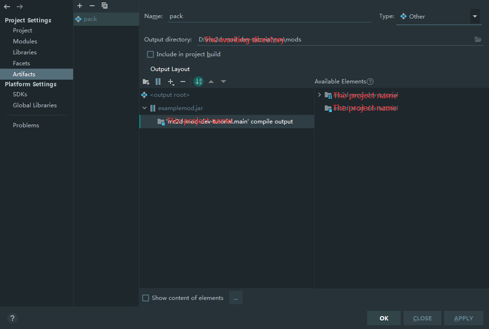

# 调试你的模组

每次写好后都要打包很麻烦？我们将通过启动配置的方式来启动游戏。

本篇假设读者使用IntelliJ IDEA。

1. 点击`Add configuration...`。
2. 点击`+`，选择`Application`。
3. 起个名字。模块选择带`main`的。
4. 设置主类为`io.github.overrun.mc2d.Main`。并设置运行目录。
5. 在运行目录下手动创建`mods`文件夹。
6. 新建一个Artifact并设置成类似于图中的样子。然后点击OK。
7. 在启动配置的Before launch中添加你的Artifact。

现在点击启动！

## 额外的启动配置

默认情况下，控制台并不会高亮显示。要解决此问题，您只需要添加一条VM Option即可。

```properties
-Dmc2d.log.disableAnsi=false
```